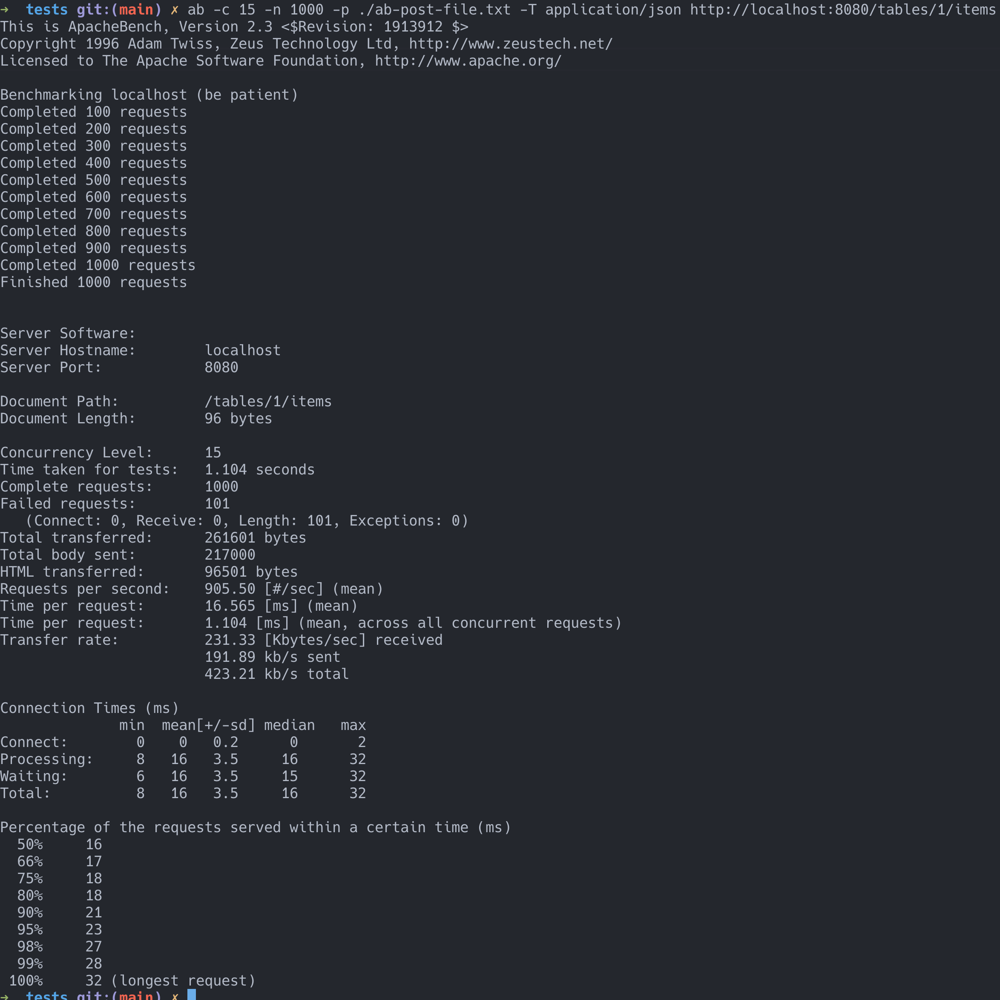

# Simple Restaurant API 


## Run the service

### with `docker`
```sh
$ docker compose build 
$ docker compose up 
```
### without `docker` 
```sh
$ mysql.server start
$ cargo clean && cargo build && cargo run 
```

## API Tests 

### load test from requirements
"The application MUST accept at least 10 simultaneous incoming add/remove/query requests."



### Run with `hurl`
All API tests under `tests` folder
```sh
$ hurl --test . 
```

### Manual test examples with CURL
#### Add new items
```sh
$ curl -X POST 'localhost:8080/tables/1/items' \
       -H 'Content-Type: application/json' \
       -d '{"items_names": ["Pizza", "Pasta", "Salad", "Ramen", "Soup"]}'  
```
Response:
```json
{
   "status":"success",
   "message":"Added 5 item(s) to table 1",
   "items_ids":[ 11, 12, 13, 14, 15 ]
}
```

#### Get all items for a table
```sh
$ curl 'localhost:8080/tables/1/items'
```
Response: 
```json
[
   {
      "item_id":11,
      "table_number":1,
      "item_name":"Pizza",
      "ordered_on":"2024-12-02 04:34:35",
      "prepare_minutes":15,
      "_links":[
         {
            "href":"/tables/1/items/11",
            "rel":"self",
            "method":"Get"
         },
         {
            "href":"/tables/1/items/11",
            "rel":"delete",
            "method":"Delete"
         },
         {
            "href":"/tables/1",
            "rel":"table",
            "method":"Get"
         }
      ]
   },
   {
      "item_id":12,
      "table_number":1,
      "item_name":"Pasta",
      "ordered_on":"2024-12-02 04:34:35",
      "prepare_minutes":6,
      "_links":[
         {
            "href":"/tables/1/items/12",
            "rel":"self",
            "method":"Get"
         },
         {
            "href":"/tables/1/items/12",
            "rel":"delete",
            "method":"Delete"
         },
         {
            "href":"/tables/1",
            "rel":"table",
            "method":"Get"
         }
      ]
   },
   {
      "item_id":13,
      "table_number":1,
      "item_name":"Salad",
      "ordered_on":"2024-12-02 04:34:35",
      "prepare_minutes":9,
      "_links":[
         {
            "href":"/tables/1/items/13",
            "rel":"self",
            "method":"Get"
         },
         {
            "href":"/tables/1/items/13",
            "rel":"delete",
            "method":"Delete"
         },
         {
            "href":"/tables/1",
            "rel":"table",
            "method":"Get"
         }
      ]
   },
   {
      "item_id":14,
      "table_number":1,
      "item_name":"Ramen",
      "ordered_on":"2024-12-02 04:34:35",
      "prepare_minutes":9,
      "_links":[
         {
            "href":"/tables/1/items/14",
            "rel":"self",
            "method":"Get"
         },
         {
            "href":"/tables/1/items/14",
            "rel":"delete",
            "method":"Delete"
         },
         {
            "href":"/tables/1",
            "rel":"table",
            "method":"Get"
         }
      ]
   },
   {
      "item_id":15,
      "table_number":1,
      "item_name":"Soup",
      "ordered_on":"2024-12-02 04:34:35",
      "prepare_minutes":6,
      "_links":[
         {
            "href":"/tables/1/items/15",
            "rel":"self",
            "method":"Get"
         },
         {
            "href":"/tables/1/items/15",
            "rel":"delete",
            "method":"Delete"
         },
         {
            "href":"/tables/1",
            "rel":"table",
            "method":"Get"
         }
      ]
   }
]
```

#### Delete the item in a table 
```sh
$ curl -X DELETE 'localhost:8080/tables/1/items/11'
```
Response: 
```json
{
   "status":"success",
   "message":"Removed item id: 11"
}
```

#### Get the item in a table
```sh
$ curl 'localhost:8080/tables/1/items/12'
```
Response:
```json
{
   "item_id":12,
   "table_number":1,
   "item_name":"Pasta",
   "ordered_on":"2024-12-02 04:34:35",
   "prepare_minutes":6,
   "_links":[
      {
         "href":"/tables/1/items/12",
         "rel":"self",
         "method":"Get"
      },
      {
         "href":"/tables/1/items/12",
         "rel":"delete",
         "method":"Delete"
      },
      {
         "href":"/tables/1",
         "rel":"table",
         "method":"Get"
      }
   ]
}
```
```sh
$ curl 'localhost:8080/tables/1/items/11'
```
Response:
```json
{"message":"Can NOT found the resource"}
```
